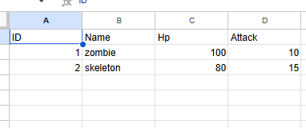
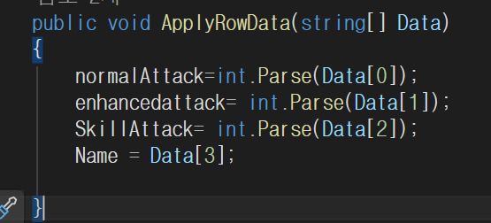
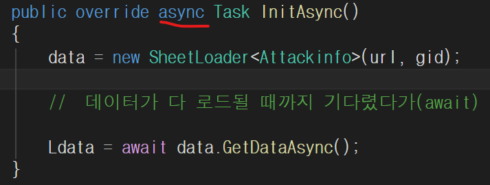
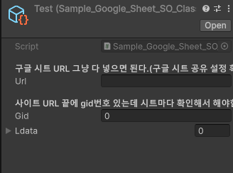
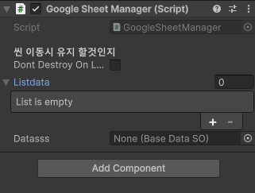
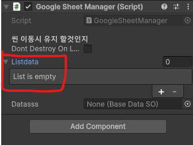
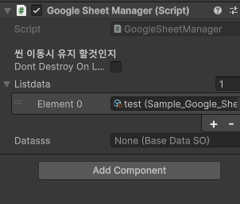
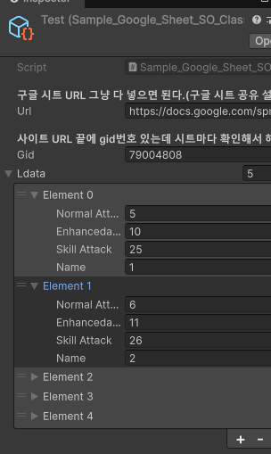
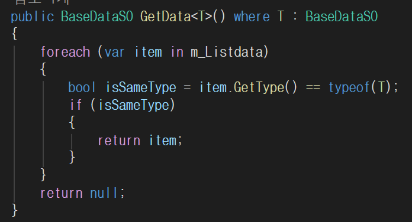

일단 사용법

---
  
시트 데이터를 담을 클래스를 만들어 줍니다. (SheetClass폴더 내부에 샘플코드 있다.)  


- 클래스 제작 시 ISheetParsable, IIdentifiable 2개의 인터페이스를 상속하여 구현한다.  

- ISheetParsable
  -   public void ApplyRowData(string[] Data)를 구현하면 된다.
  - 함수는 파싱할 데이터 순서대로 셋팅해주는 작업을 해주면 됩니다.  
  참고 이미지
  
- IIdentifiable

 - 불러온 데이터가  ``List<DataType>``으로 저장될텐데 특정 데이터를 꺼내 쓸 때   
  ``판별용 인터페이스`` 입니다
  -  public string Name { get; set; }
  
  -  사용시 ``[field: SerializeField]``붙여주셔야 하이라이키 창에서 확인 가능합니다.  
   예시 ``[field: SerializeField]public string Name { get; set; }``

 클래스가 구현이 됐다면 이제 로드할 준비작업을 해야합니다.  
 그 내용은 아래에서 확인 하기.  

----

기존에  구현 한 구글시트 로드는  
하나의 시트만 로드 가능해서 확장부분에 가능을 열어두고 개발을 했다. 

 BaseDataSO클래스
``` Csharp
public  abstract class BaseDataSO : ScriptableObject
{
    [Header("구글 시트 URL 그냥 다 넣으면 된다.(구글 시트 공유 설정 확인 바람)")]
    public string url;
    [Header("사이트 URL 끝에 gid번호 있는데 시트마다 확인해서 해야함")] 
    public int gid;

    public abstract Task InitAsync();
}
```
우리가 데이터를 파싱하기 위해서  필요한 변수,메소드들을   
 추상클래스로 구현을 했다.  

 - public string url
   - 구글 시트 url을 전부 넣어주면 된다.  
- public int gid;
   - 시트의 고유 ID라고 보면된다. url 뒤에 gid=@@ 라고 나오니깐 확인 바람

-  public abstract Task InitAsync();
    - 데이터를 비동기 방식으로 가져오기 위해 만든 메서드 이다.  
    - 요 추상 클래스를 상속받아 구현하는 쪽에서는 Task 앞에 async 키워드를 붙여야 한다. 
 

 ---

# BaseDataSO클래스 를 상속받아 구현하는 클래스
저희가 파싱할 데이터 타입이 하나가 아닌 여러개의 타입이 있다보니 그타입에 맞게 구현을 해줘야 합니다.  


```Csharp
using System.Collections.Generic;
using System.Threading.Tasks;
using UnityEngine;
[CreateAssetMenu(menuName ="chardata",fileName ="test")]
public class Sample_Google_Sheet_SO_Class : BaseDataSO
{
    private SheetLoader<Attackinfo> data;
    [SerializeField] public List<Attackinfo> Ldata = new List<Attackinfo>();
    public override async Task InitAsync()
    {
        data = new SheetLoader<Attackinfo>(url, gid);

        //  데이터가 다 로드될 때까지 기다렸다가(await) 리스트를 받아옵니다.
        
        Ldata = await data.GetDataAsync();
    }
}
```

-  ``SheetLoader<T>`` 파싱할 데이터 타입을 ``<T>``  안에 넣어주고 변수 구현 해 줍니다.
    - 예시  private SheetLoader<Attackinfo> data;
- 다음 파싱해서 데이터를 저장할 ``List<T>`` 구현해 줍니다. 
   -  [SerializeField] public List<Attackinfo> Ldata = new List<Attackinfo>();

-    public override async Task InitAsync()를 구현해주는데
     -  data = new SheetLoader<Attackinfo>(url, gid); <--데이터를 파싱해준다
     -  Ldata = await data.GetDataAsync();  
     <-- 데이터를 ``List<T>``에 맞게 변형 후 삽입 해주는 작업.

그래서 데이터를 꺼낼 때 ``public List<T>  변수명 `` 접근해서 꺼내쓰면 된다.

---
# 데이터 에셋 만들기
위에 스크립트는 스크립터블 오브젝트 스크립트이다. 그러니 데이터를 만들어서 써야한다.  
   
데이터를 만드신 후   

   
 데이터 인스펙트 창 보시면 url,gid 넣는 부분이 있습니다.  
 이부분 채워 주시고 

``GoogleSheetManager`` 클래스를 이용하여  
 데이터를 파싱할 마지막 준비를 하면 됩니다.   


----
# GoogleSheetManager 사용방법  
게임 시작할 때 파싱해서 필요할 때 가져오는 방식을 쓰는것으로 알고 있다.    
그래서 요 매니저 클래스는 게임 시작 하는 씬에 게임오브젝트로 붙을거 같다.  


  
기본적으로 싱글턴 처리한 상태이고  
씬 이동 시 매니저클래스가 붙은  오브젝트 유지할건지 체크하는 부분이 있는데 체크를 해서    
씬 이동 시 오브젝트 유지하게 하면 된다.  

그리고 만든 데이터를   
  
``Listdata``로 넣어주시면 준비는 끝났습니다.  

  
요 상태에서 에디터를 실행하게되면 List 타입인 ``Listdata`` 를 순회 하면서 데이터를 파싱하게 됩니다.  
파싱된 이미지    


----
# 불러온 데이터 추출해서 쓰기 
  
매니저 클래스에서 데이터를 파싱하고 List로 들고 있을텐데  
데이터를 꺼내 쓰는 방법은 다음과 같다.  
  ``var data=GoogleSheetManager.Instance.GetData<T>();``  
그 후에 
```Csharp
  Sample_Google_Sheet_SO_Class : BaseDataSO
  BaseDataSO상속한 스크립트에서 List<T>접근해서 데이터 빼서 쓰면 된다. 
 ```
  끝
