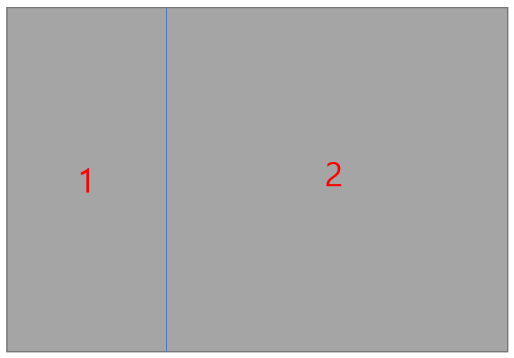
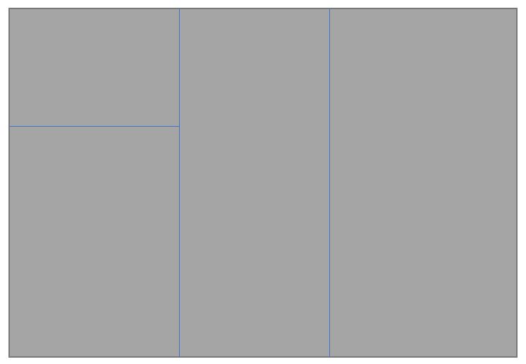
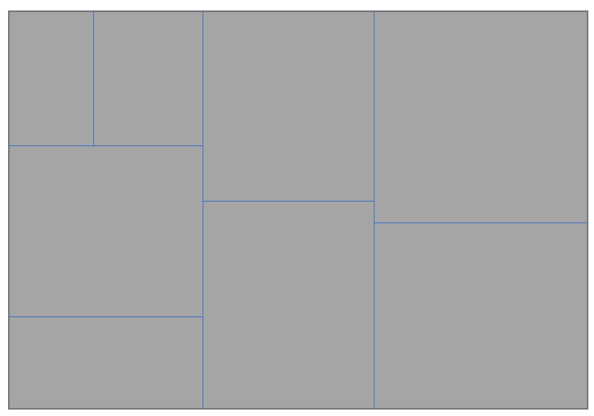
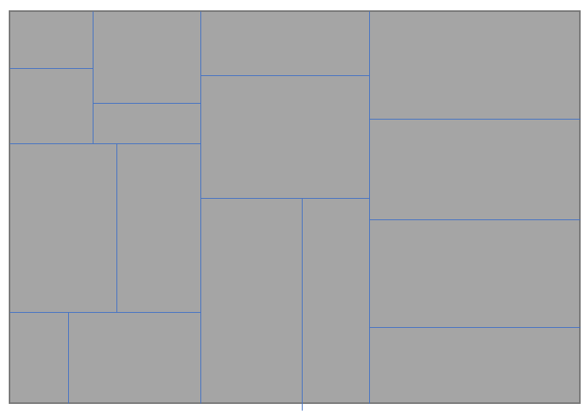
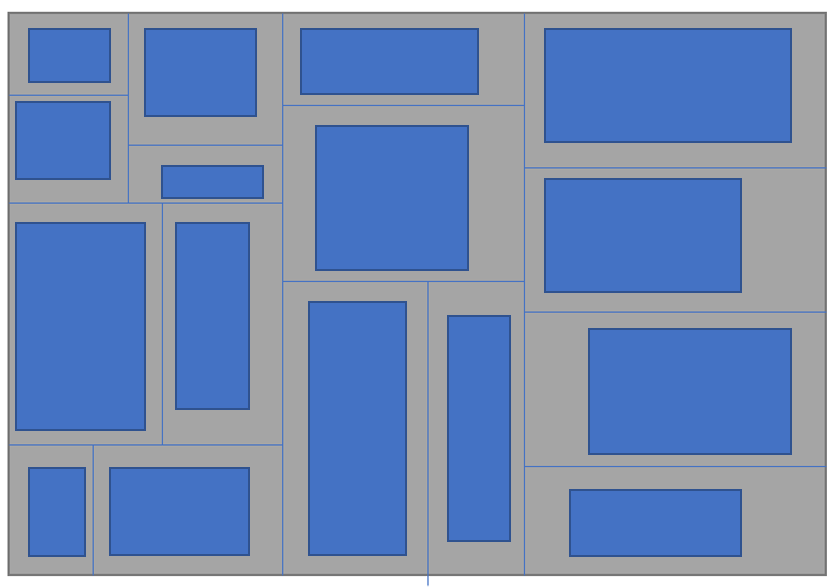
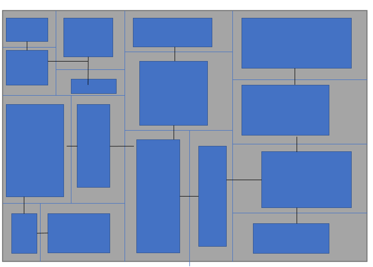

[BSP알고리즘]

- Node 클래스 설계  
  - 구역(rect) vs 방(roomRect): rect는 쪼개진 전체 땅이고, roomRect는 그 안에 실제 그려진 작은 사각형  
  
  - 부모(parent) 참조: 자식 노드들이 서로 연결되려면 부모를 거쳐가야 합니다. 생성자에서 parent가 제대로 할당되는지 확인

  - IsLeaf()의 타이밍: 자식(left, right)이 둘 다 null인 순간이 바로 **"진짜 방"**을 그려야 할 시점임을 인지

- 분할 로직  
무한 루프에 빠지지 않고 균형 잡힌 공간을 만드는 로직  
  - 중단 조건: if문에서 minRoomSize * 2를 기준으로 멈추는 로직이 정확한지 보세요. 이 수치를 1로 줄이면 맵이 어떻게 터지는지 실험

  - 가로/세로 결정: Random.value > 0.5f로 결정하지만, 한쪽이 너무 길쭉해지면(1.5배 이상) 강제로 반대 방향으로 자르는 예외 처리가 작동하는지 확인  

  - splitPos 계산: 랜덤하게 자를 때 minRoomSize만큼의 최소 여백을 남기고 자르는지 계산식을 검토

- 생성 및 연결  
죽은 공간에 길을 내어 생존 가능하게 만드는 단계입니다.
  - 재귀 순서: GenerateContents가 가장 깊은 곳(Leaf)까지 먼저 내려갔다가 올라오면서 통로를 만드는지 확인

  - 자 통로 로직: 가로(x)로 먼저 이동하고 그다음 세로(y)로 이동할 때, 꺾이는 지점(Corner)의 좌표가 정확한지 체크

  - 중심점 연결: 구역의 center 좌표를 사용하면 방이 구석에 있어도 통로가 방을 뚫고 지나가 연결이 보장됩

- 시각화  
 데이터를 눈에 보이는 타일로 치환하는 단계입니다.
  - 이중 For문 범위: rect.x - 1부터 rect.xMax까지 순회하며 벽(Wall)을 한 칸 더 넓게 두르는 로직이 맞는지 확인

  - 타일 덮어쓰기 방지: GetTile == floorTile 체크를 통해 통로가 만들어 놓은 바닥을 벽이 다시 덮어버리지 않는지(길이 막히지 않는지) 확인

  - 타일 덮어쓰기 방지: GetTile == floorTile 체크를 통해 통로가 만들어 놓은 바닥을 벽이 다시 덮어버리지 않는지(길이 막히지 않는지) 확인

----
참고 링크 :   
https://sharp2studio.tistory.com/44  
https://sharp2studio.tistory.com/45

----
### BSP 알고리즘 이론 정리

BSP 알고리즘 (Binary Space Partitioning)은 한국어로 이진 공간 분할법이라는 뜻

- 한 공간을 계속해서 2개로 나눠주면서 맵을 만든다.

---

위와 같은 그림의 전체적인 맵이 주어졌다고 가정을 할 때, 이 공간을 둘로 나눠준다. 

전반적으로 맵의 크기가 균형있게 되려면, 가로와 세로 중 더 긴 방향을 둘로 나눠주는게 좋은 결과가 나오게 된다.

위의 사각형은 가로가 더 기므로 가로로 나눠주면 되는데, 정확히 반반으로 나누기 보다는 랜덤한 좌표에서 잘라준다면  
  
  이런식으로 2개의 공간으로 나눠지는걸 볼 수 있다.  
  또한, 처음 공간을 root 노드라고 생각한다면,

root 노드의 자식 노드(왼쪽, 오른쪽 두가지 존재)는   
1,2번 노드가 되는 것이고, 1,2번 노드의 부모노드는 root 노드가 된다.

다시, 나눠진 공간을 반복해서 나눠준다.

이 때, 왼쪽으로 나눠진 공간은 세로가 더 기므로 이번에는 세로로 나눠주도록 하겠다.  

  

위 모양과 같이 랜덤한 형태의 여러 방으로 나눠지는 모습을 볼 수 있게 된다  
다음과 같이 공간을 나누고, 게임 내에서 각 방을 만들고 싶다면
  

나누어진 공간에 기반해서, 공간보다 작은 랜덤한 크기의 방을 공간의 임의의 위치로 이동시킨다.

위 공간들은 tree에서 모두 leaf node에 해당되는 공간들이다.

이제 마지막으로 방들을 이을 길을 만들어주면 되는데, 길은 leaf node가 아닌 노드들에서 각 자식 노드들을 잇는 길을 만들어주면 된다.

이 때, 잘라진 방향과 수직으로 길을 만들어주면 된다.  

