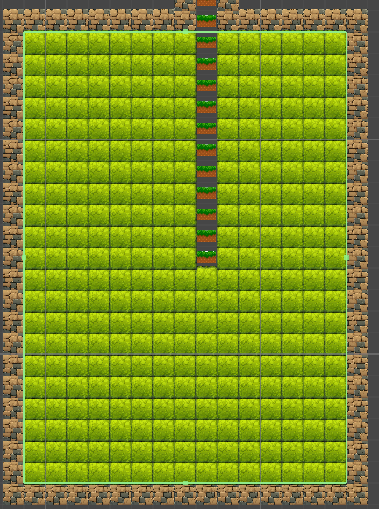
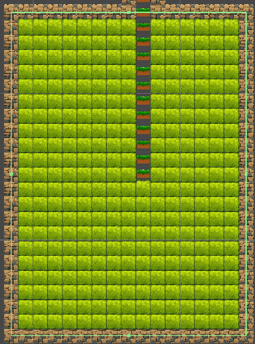

# BSPNode

```CSharp
using UnityEngine;

public enum RoomType{NULL,StartNode,MiddleNode,RestNode,BossNode}
기획서 대로 방타입을 지정해 주는  enum 설정

enum 설명
1. NULL 초기화 되기 전  enum값으로 설정
2. StartNode : 베이스 캠프 (스테이지 시작 방)
3. MiddleNode : 일반 전투 노드
4. RestNode :  쉼터 방
5. BossNode : 보스방
```

----


```CSharp
using UnityEngine;

public enum RoomType{NULL,StartNode,MiddleNode,RestNode,BossNode}
 
public Class BSPNode
{
    public RectInt rect;       // 쪼개진 전체 구역
    public BSPNode left;       // 자식 1
    public BSPNode right;      // 자식 2
    public BSPNode parent;     // 부모 (통로 연결 시 역추적용)
    public RectInt roomRect;   // 구역 내에 실제로 그려진 방의 범위
    public RoomType roomType = RoomType.NULL; //방의 속성 일단 NULL
    public BSPNode(RectInt rect, BSPNode parent = null)
    {
     this.rect = rect;
     this.parent = parent;
    }

    public bool IsLeaf() => left == null && right == null;
}
```

----
# RectInt
```Csharp
// x가 0, y가 0인 위치에서 가로 10, 세로 10짜리 사각형을 만든다!
RectInt myRoom = new RectInt(0, 0, 10, 10);

```
- ``myRoom.x``, ``myRoom.y``: 사각형의 왼쪽 아래 맨 끝점 좌표야. (시작점)
- ``myRoom.width``, ``myRoom.height``: 사각형의 가로, 세로 길이.
- ``myRoom.xMin``, ``myRoom.yMin``: 사각형의 최소 x, y 좌표. (결국 x, y랑 똑같아)
- ``myRoom.xMax``, ``myRoom.yMax``: 사각형의 오른쪽 위 맨 끝점 좌표야. (x + width, y + height를 알아서 계산해 줌)
- ``myRoom.center``: 사각형의 정중앙 좌표! (주의: 중심점은 소수점이 나올 수 있어서 Vector2로 반환돼. 예를 들어 길이가 3이면 중심은 1.5니까!)
---

# BSPDungeonGenerator

---
# 플레이어 입장시 입구 막기


  
플레이어 입장 시 맵의 크기 만큼 사이즈가 잡혀 있는 콜라이더 때문에   
플레이어를 쉽게 감지할수 있다.  

플레이어가 맵에 들어오면 벽으로 막아야하는데
어떻게 하면 막을 수 있을까 하다가   
콜라이더의 크기를 1씩 늘려봤더니  
  
테두리 벽사이즈 맞게 커진다 그러면 콜라이더 size.x,y의 사이즈를 +1한 값으로  
뭘하면 좋을거 같은데..  

- 1.콜라이더 또는 방 크기값보다+1된 위치에서 벽 타일이 아닌지 검색하면 될거 같은데 흠.. 잘 모륻겠다.  


----

