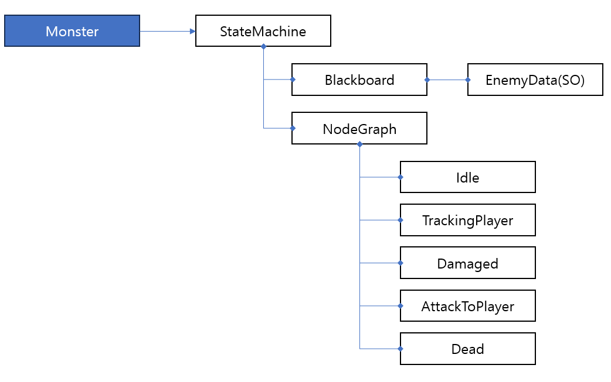

# Component

- Data
  - ScriptableObject 로 부터 Data를 Instantidate 혹은 Deepcopy 를 한 데이터.
- State Machine
  - Monster 의 State 를 관리하는 Machine
- Movement
  - Monster 의 이동을 담당
- Actions
  - Pures; 직접적인 객체 제어가 없는 Action 위주
    - 데미지 계산, 몬스터 버프/디버프 같은 것들 등
  - Monobehaviors; 직접적인 객체 제어가 있는 Action 위주
    - 애니메이션, 물리제어 등
  

# Class Design

> 아래는 확정은 아니며, 추후 기획에 따라 변동이 있을 예정

- Monster 에 StateMachine Component 를 중심으로 이하 위 그림과 같은 구조로 제작 예정.
- Move 나 Attack 관련 Monobehavior 는 Component 로 들어가 "Action" 에서 이를 불러와 실행하는 방향으로 진행 예정.
