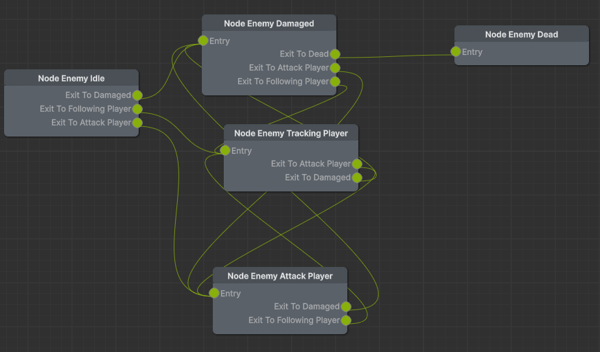

# 사용 이유
- Monster 의 행동을 State 로 관리하기 위함.
- State 사용시 Graph 적으로 보이기도 좋고 개발 편의성도 높아짐.

# 간단 사용 방법

## Script 생성

### xNode Script

- 각 State 에 대한 정의.
- 아래 내용에 대하여 필수 구현 필요
  - Input / Output Port
    - 특정 Data Type 으로 할 경우 해당 Data Type 에 대한 조건으로 Port 이동 가능
    - Data Type 을 빈 Class 로 하고, PortName 을 Return 할 경우, 알아서 인식됨.
      - 그러기 위해서는 Graph 에서 해당 Node 들에 대한 추가 및 연결 필요
      
    - Input/Output Node 는 Multiple 하게 가능함.
  - Behavior ; 해당 State 에서 객체가 해야 할 행위에 대한 정의
  - Transition ; 특정 Transition 에 따른 State Change 가 발생. Node 간 간선에 해당.
```csharp
// Example
public class NodeEnemyTrackingPlayer : EnemyBaseNode 
{
	[Input] public EnemyStateConnection entry;
	[Output] public EnemyStateConnection exitToAttackPlayer;
	[Output] public EnemyStateConnection exitToDamaged;
	
	public override string Execute(EnemyBlackboard blackboard)
	{
		// Trigger 의 Condition 해당 Node 의 상태에 따라 구현
        // ex1) 사정거리 이내에 타겟이 있다.. 거나
        // ex2) 두둘겨 맞고 있다거나 등...
		if (blackboard.IsAttacking) return "exitToAttackPlayer";
		if (blackboard.IsDamaged) return "exitToDamaged";
		return null;
	}
}
```

### xNode Graph Script

- Node 의 Graph 를 관리하는 스크립트.
- 해당 Script 를 만들면 Unity 생성 메뉴에 같은 이름으로 Graph 가 생성됨.
  - 생성된 Graph를 더블 클릭하면 위 Node 그림과 같은 그래프 확인 가능.

### State Machine

- State Machine 는 xNode 자체와는 거리가 있음.
- 다만, xNode 는 State 를 "관리"하는 역할로 두고, State 의 변화에 다른 행위 혹은 공통적인 Node 내 함수 실행등 Node 에 대한 제어와 EventLoop 는 이와 같이 별도 구현을 하는 것이 좋음.
  


