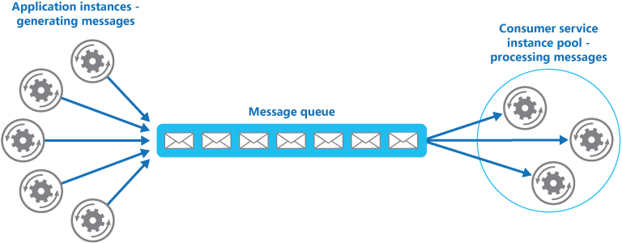
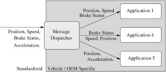

# 개발 배경
현재 각각의 기능 - `플레이어, 업그레이더, 무기, 몬스터, 맵 등` - 들이 모두 각기 놀고 있음.
하지만 게임 내에서는 각 기능이 긴밀한 데이터 통신을 할 필요가 있음.

이에 대한 제안을 하였는데, 현재로써는 SingleTon 밖에 답이 없다는 이야기가 나옴.
하지만 SingleTon 으로 모두 구성하면 많은 제약이 생김

- 스파게티 코드가 될 위험성이 큼
- 객체간 너무 끈끈한 연결이 됨 (의존 역전 법칙 위배)

위 내용을 근거로 객체간 데이터를 연결해줄 Hub 역할을 할 수 있는 클래스를 개발을 시도하게 됨.

# 아이디어 출처

Web 개발시 Micro Service Architecture 에서 Message Queue 를 이용한 Service 별 통신 방식에서 착안



# 설계

기본적으로 Observer Pattern 유사 디자인을 구성. AI 에게 용어를 물었더니 Message Dispatcher 라고..



일종의 "우편배달부" 라고 생각하면 좋을 것 같음.

## 기본 설계 형태

```csharp
public enum MsgType {
    msgType01,
    msgType02, 
    ...
}

public class PostManager : SingleTon<PostManager>
{
    // 메시지 타입별로 구독하고 있는 함수들의 목록
    private Dictionary<MsgType, List<Action<object>>> _subscribers = new();

    // 구독 
    public void Subscribe(MsgType msgType, Action<object> callback) { ... }

    // 해제 
    public void Unsubscribe(MsgType msgType, Action<object> callback) { ... }

    // 발송 
    public void Post(MsgType msgType, object data) { ... }
}
```

- Subscribe/Unsubscribe : 실제 동작할 함수에 대한 구독 및 해제
- Post : 동작할 함수에 Data 를 건내 동작시킴 (Invoke 포함)

## Object Data 관련

- 위 디자인에서 고민을 가장 많이 한 것이 "Generic" 한 데이터 타입.
- 즉, 참 타입이든 값 타입이든 모든 타입을 받아주는 것이 필요했음.
- 일단, 객체는 기본적으로 `object` 타입으로 `upcasting`됨.
- `Struct` 의 경우 `Boxing`됨.

=> 결론은 `object`로 하면 `Boxing` 으로 인한 GC 가 지나치게 많아지므로 폐기.

## Generic 사용시?

- `Dictionary`는 명확한 타입을 지정하여 선언해주어야 함.
```csharp
Dictionary<string, Action<int>> dict01 = new();
Dictionary<string, Action<T>> dict02 = new();
// ---------- 실행 결과
/*
Build with surface heuristics started at 21:09:41
Use build tool: C:\Program Files\dotnet\sdk\10.0.104\MSBuild.dll
CONSOLE: msbuild 버전 18.0.11+80d3e14f5(.NET용)
CONSOLE: 빌드 시작: 2026-03-26 오후 9:09:41
CONSOLE: 1 노드의 "C:\Users\mybeang\AppData\Local\Temp\Jatowup.proj" 프로젝트(기본 대상)입니다.
CONSOLE: ControllerTarget:
CONSOLE:   Run controller from C:\Program Files\JetBrains\Rider\r2r\2025.3.0R\BCF63A397BE5DD45D53EE49FB08CD49\JetBrains.Platform.MsBuildTask.v17.dll
0>------- Started building project: Sandbox
-- skip --
0>Program.cs(37,35): Error CS0246 : 'T' 형식 또는 네임스페이스 이름을 찾을 수 없습니다. using 지시문 또는 어셈블리 참조가 있는지 확인하세요.
0>------- Finished building project: Sandbox. Succeeded: False. Errors: 1. Warnings: 0
Build completed in 00:00:02.636
*/
```

## 방법이 없을까?

- Interface 로 선언하는 방식
```csharp
public interface IPostMessages { }

class PostMessages<T> : IPostMessages
{
    public Action<T> actions;
}

// -- skip --

Dictionary<string, Action<int>> dict01 = new();
// 문제 없음.
Dictionary<string, Action<IPostMessages>> dict02 = new();
```
> 솔직히 도저히 답이 안나와 AI 와 연구함.

# 구현

`02.Script -> Common -> Manager -> PostManager.cs` 참고

# 기능 사용 법

## Case1.
>  Player 의 Transform 을 등록하고, Monster 가 이를 알아야 하는 경우
```csharp
// PostMessageKey.cs
public enum PostMessageKey 
{
    PlayerTransform
}

// player.cs

public class Player : Monobehavior
{
    private void Update() 
    {
        // Update 마다 Post 하는 것은 CPU 에 부하가 생길 수 있으므로,
        // Cache 등을 통해 transform.position 정보가 변경되었을 경우만 보낼 수 있도록
        // 하여 최적화를 노리는 것도 하나의 방법.
        PostManager.Instance.Post<Transform>(PostMessageKey.PlayTransform, transform)
    }
}

// monster.cs
public class Monster : Monobehavior
{
    private Transform _targetTf;

    private void OnEnable() 
    {
        PostManager.Instance.Subscribe<Transform>(PostMessageKey.PlayTransform, TargetTransformUpdate)
    }

    
    private void OnDisable() 
    {
        PostManager.Instance.Unsubscribe<Transform>(PostMessageKey.PlayTransform, TargetTransformUpdate)
    }

    private void TargetTransformUpdate(Transform targetTransform) 
    {
        _targetTf = targetTransform;
    }
}
```
